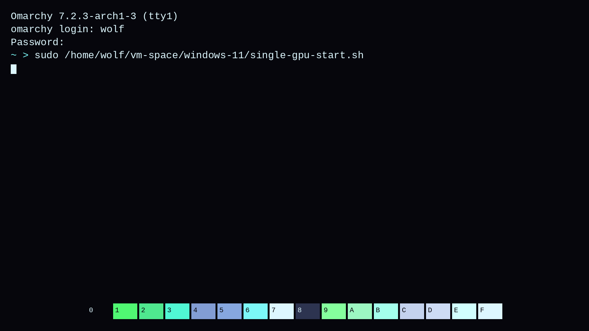
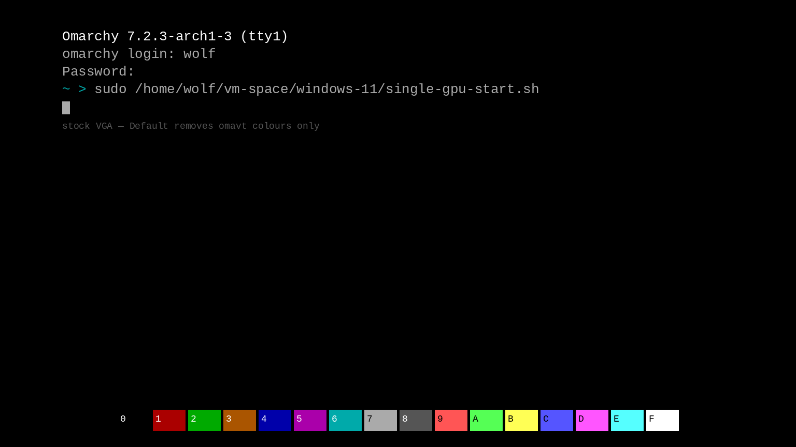

# OmaVT

**Omarchy themes your desktop. OmaVT carries the same palette into the virtual
console — VT-session mockups in the Style menu, then `vt.default_*` on the
kernel command line.**



## Why a TTY theme picker

Stock Omarchy paints Hyprland, graphical terminals, Plymouth unlock, and (with
OmaBoot) the Limine menu. Drop to Ctrl+Alt+F3 after a bad splash, a single-GPU
passthrough VM hop, or just because you like living on `/dev/tty*`, and you get
classic VGA grey. Your desktop wears Vantablack or Hackerman; the console still
looks like 1987.

OmaVT closes that gap so the **same colours** show up when:

- Plymouth has been tinkered into an early quit and you land on a text prompt
- You leave a VFIO / VM-curator machine and the TTY hops you back toward SDDM
- You want big Terminus faces (OmaTTY) *and* a theme palette that matches boot
  and unlock — cohesive from Limine → Plymouth → getty → desktop
- Something like `cliamp` is whipping the console and you still want it pretty

Pair with [OmaTTY](https://github.com/AlxWolfenstein97/omatty) for font size /
accessibility; OmaVT is the palette half of that story.

## Goals (and honest limits)

These Style plugins extend Omarchy’s theme system **without requiring theme
authors — or you — to ship anything extra**. Official themes, your forks, and
third-party installs all work as long as they have a `colors.toml`. That
“every theme” contract is intentional: once the desktop can follow farther,
making *another* theme is more worth it. Longer origin / stop-line:
[Chroma](https://github.com/AlxWolfenstein97/chroma).

| Goal | What that means here |
|------|----------------------|
| Zero extra assets | No `preview-tty.png`, no per-theme VT files. Colours come from `colors.toml` alone. |
| Extreme compatibility | Stock + user + foreign themes all appear in the picker automatically. |
| True Theme Vibe | Top-left getty session + 16-colour strip from `colors.toml` / VGA Default. **Much closer** to a real TTY than a framed fake window — still not a live `/dev/tty` capture. |
| Carousel-safe | Mockups are 1536×864 with ~8% side inset (SAFE_X=120). Session stays top-left *inside* that margin so the 768×475 tile crop does not shave getty text. |
| Snappy pickers | Mockups warm in parallel across CPU cores and **skip tiles whose `colors.toml` (and layout version) haven’t changed** — reopen is near-instant. On par with Omarchy’s stock Style carousels. |

We are **not** putting WYSIWYG screenshots in themes. Themes stay palette-only;
OmaVT draws the session itself. Same True Theme Vibe idea as
[OmaBoot](https://github.com/AlxWolfenstein97/omaboot).

### Why a picker (and no theme-set hook)?

VT colours hitch a ride on the kernel cmdline and want a password — not a
silent sync on every desktop theme flip. The carousel exists so you can preview
the console palette across **all** installed themes without rebooting for each
guess. Pair with OmaTTY for fonts; same preview-first pattern as OmaBoot /
OmaOBS.

## What you get

- **Style → TTY Themes** — labelled image picker (`omarchy-menu-images`).
- **Live theme discovery** — every Omarchy theme with a `colors.toml`.
- **Default tile** — stock VGA. Picking it **removes only** the OmaVT colour
  drop-in so you can switch back without rewriting anything else.
- **Safe cmdline patch** — one file,
  `/etc/limine-entry-tool.d/omavt-colors.conf`, appending
  `vt.default_red` / `vt.default_grn` / `vt.default_blu` / `vt.color`.
  `/etc/default/limine` (your `intel_iommu=on`, `iommu=pt`, root=, …) and
  `omarchy-defaults.conf` are never opened, never restored.
- **Live try** — `setvtrgb` when available; cold consoles need a reboot for the
  cmdline to stick.
- **No theme-set hook** — applying needs a password; pick when you mean it.

## Mockups: True Theme Vibe (shared session with OmaTTY)

Limine / TTY have no headless renderer worth depending on, and themes will not
ship console screenshots. The drawer paints one getty session, then recolours
it from each theme’s palette (plus a VGA **Default** tile).

**How it was done**

1. Nested Omarchy-in-Omarchy QEMU cannot Ctrl+Alt+F3 (no GPU passthrough — that
   hops the **host**). Disable SDDM in the guest, land on **tty1**, log in as
   a demo user, run the single-GPU passthrough starter path.
2. Trace that chrome in Pillow: top-left banner / login / `~ >` command, block
   cursor, 16-colour strip at the bottom. Same session script as
   [OmaTTY](https://github.com/AlxWolfenstein97/omatty) (fonts use real PSF
   glyphs on the same lines).
3. Recolour from every installed theme’s `colors.toml`. Themes stay
   palette-only; the plugin owns the art.

**Compare — real default TTY vs generated Default mockup:**

| Real getty (QEMU, stock VGA / tty1) | OmaVT Default mockup |
| --- | --- |
|  |  |

Hero at the top is the same session on **Hackerman**. Pair with OmaTTY when you
want the face size to match that path too.


## Marketplace consent (hooks & Style menu)

Installing the plugin only drops the code. Style menu rows and theme-set hooks
edit your Omarchy config, so they stay **opt-in**.

**Fast path (no prompts)** — from your home folder:

```sh
~/.config/omarchy/plugins/io.github.alxwolfenstein97.omavt/install.sh --yes
```

`--yes` means: I consent — arm everything this plugin supports, skip Y/n. Interactive `./install.sh` (no `--yes`) still asks — Workshop-safe; `--yes` / arm-all are optional shortcuts.
Style menu helper: `./tools/install-style-menu.sh --yes`.

**Arm the whole family in one shot** (after all plugins are installed):

```sh
~/.config/omarchy/plugins/io.github.alxwolfenstein97.chroma/tools/arm-all-family.sh
```

**Full wipe (this plugin)** — same ease as `install.sh --yes`
(teardown + `plugin remove`; best-effort `pkg drop` for deps this plugin may
have pulled — kept only when pacman still needs them elsewhere):

```sh
~/.config/omarchy/plugins/io.github.alxwolfenstein97.omavt/uninstall.sh --yes
```

**Wipe the whole family** (each plugin’s `uninstall.sh --yes`, then a final
shared-dep sweep — paint / hooks / menus / DRM / SDDM / root extras gone):

```sh
~/.config/omarchy/plugins/io.github.alxwolfenstein97.chroma/tools/wipe-all-family.sh
```

Interactive `./install.sh` still asks [Y/n] if you prefer. Quiet shell restarts
only restore what you already armed. `./uninstall.sh` clears the arm flags.


## Install

Workshop-style one paste (enable + integrate; installer asks [Y/n]):

```bash
omarchy plugin add https://github.com/AlxWolfenstein97/omavt.git --enable
~/.config/omarchy/plugins/io.github.alxwolfenstein97.omavt/install.sh
```

That clones into `~/.config/omarchy/plugins/io.github.alxwolfenstein97.omavt` and arms hooks / Style after you
confirm. Skip prompts: `~/.config/omarchy/plugins/io.github.alxwolfenstein97.omavt/install.sh --yes`.

Or from an existing checkout:

```bash
~/.config/omarchy/plugins/io.github.alxwolfenstein97.omavt/install.sh
omarchy plugin enable io.github.alxwolfenstein97.omavt
```


## How it works

1. `bin/omavt-switcher` renders PNG mockups into
   `~/.cache/omarchy/omavt/previews/` (including `default.png`), then opens
   `omarchy-menu-images`.
2. On selection, Style launches a floating terminal running `omavt-set`
   (same privilege pattern as Unlock).
3. A themed pick writes `/etc/limine-entry-tool.d/omavt-colors.conf` and runs
   `limine-update`. **Default** deletes that file only — it does not restore
   stock Omarchy cmdline snippets. That rebuild is the slow bit — it is for
   the *next* cold boot / future hops, not the live retint.
4. `setvtrgb` applies the palette **live** when you can hop to a TTY — often
   enough to preview without rebooting. Pair with
   [OmaTTY](https://github.com/AlxWolfenstein97/omatty) for a fat console face
   (DRM reapply keeps SDDM reachable after VFIO).

CLI:

```sh
omavt list
omavt preview              # warm all mockups
omavt switcher             # picker → prints slug
omavt show tokyo-night     # print managed drop-in
omavt set tokyo-night      # write drop-in (sudo)
omavt set default          # remove colour drop-in only
omavt set tokyo-night --dry-run
omavt current
```

## Disable vs remove

| Action | What happens |
|--------|----------------|
| `omarchy plugin disable …` | Shell service stops. No theme-set hook — last vt colour drop-in stays. |
| `./uninstall.sh` then disable / remove | Menu + cache/state gone. Tombstone + disable **first** so Service quiet cannot resurrect the Style row. Then this TTY runs `omavt set default` (sudo) to strip vt paint + optional y/N `pkg drop`. |
| `omarchy pkg drop python-pillow` | Optional. TTY uninstall prompts show why + `pacman Required By`. Clear/uninstall still work without Pillow. Drop may fail if other pkgs need it — that is fine. |

Quiet Service install (`--quiet`): **no package floaters** — restores already-armed
wiring only. Deps + Style consent come from interactive `install.sh`, `--yes`, or
family `arm-all-family.sh`. Menu written only if `// omavt:start` markers are
missing; also scrubs orphan Style rows for sibling plugins whose dirs were deleted
without `uninstall.sh`.

Omarchy `plugin remove` never runs `uninstall.sh` (dir delete only) — always
`./uninstall.sh` first so this TTY can reset TTY colours.

**Full wipe** — one shot (`--yes` skips pkg Y/n, best-effort drops deps this plugin may have pulled if nothing else needs them, and removes the plugin):

```sh
~/.config/omarchy/plugins/io.github.alxwolfenstein97.omavt/uninstall.sh --yes
```

## Fresh VM smoke test

```sh
omarchy plugin add https://github.com/AlxWolfenstein97/omavt.git --enable
# Style → TTY Themes appears without a shell restart; carousel tiles warm (needs python-pillow)
# Pick a loud theme; confirm the surface updates (Ctrl+Alt+F3 colours)
# plugin add alone + reboot → still no floater (quiet skips pkgs); run install.sh for deps/hooks
# Parallel install.sh: shared Pillow flock; siblings only ask for their own missing pkgs
# ./uninstall.sh → this TTY: omavt set default + optional pkg drop
# Skip pkg prompts (n) + disable → reinstall → uninstall again → answer y if you want drops
# With mangohud/goverlay kept, Pillow drop may fail — fine; clear/uninstall still work without Pillow
```

## Check

```sh
bash ~/.config/omarchy/plugins/io.github.alxwolfenstein97.omavt/check.sh
```

## Credits

- **Layout reference:** [`reference-tty-default.png`](reference-tty-default.png)
  — QEMU getty on tty1 (SDDM off in a nested Omarchy VM; no GPU passthrough).
  Demo user `wolf`, path into `…/windows-11/single-gpu-start.sh`. Compare to
  [`preview-default.png`](preview-default.png). Same session script as OmaTTY.
- Hero mockup: official **Hackerman** theme. Default tile: stock VGA.
- Sibling Style plugins: [OmaBoot](https://github.com/AlxWolfenstein97/omaboot),
  [OmaTTY](https://github.com/AlxWolfenstein97/omatty),
  [OmaOBS](https://github.com/AlxWolfenstein97/omaobs),
  [OmaCursor](https://github.com/AlxWolfenstein97/omacursor),
  [OmaHud](https://github.com/AlxWolfenstein97/omahud),
  [Chroma](https://github.com/AlxWolfenstein97/chroma).
- [Omarchy](https://omarchy.org/) — Style → Unlock pattern, theme colours, and
  Limine entry-tool drop-ins this plugin appends carefully.

## License

MIT — see [LICENSE](LICENSE).
